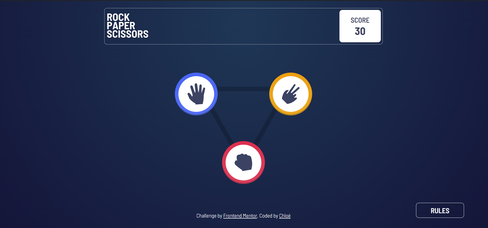
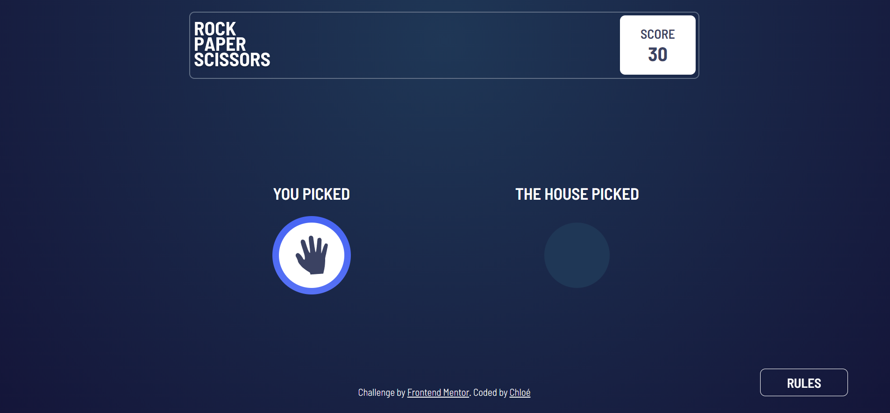
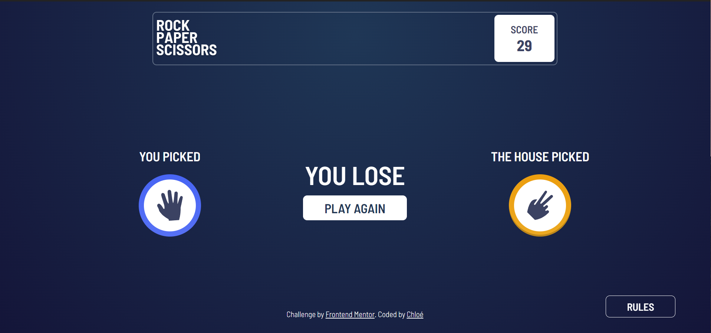

# Frontend Mentor - Rock, Paper, Scissors solution

This is a solution to the [Rock, Paper, Scissors challenge on Frontend Mentor](https://www.frontendmentor.io/challenges/rock-paper-scissors-game-pTgwgvgH). Frontend Mentor challenges help you improve your coding skills by building realistic projects.

## Table of contents

- [Overview](#overview)
  - [The challenge](#the-challenge)
  - [Screenshot](#screenshot)
  - [Links](#links)
- [My process](#my-process)
  - [Built with](#built-with)
  - [Continued development](#continued-development)
  - [Resources I got to use and things I learnt](#resources-i-got-to-use-and-things-i-learnt)
- [Author](#author)

## Overview

### The challenge

Users should be able to:

- View the optimal layout for the game depending on their device's screen size
- Play Rock, Paper, Scissors against the computer
- Maintain the state of the score after refreshing the browser

### Screenshot

### Links

- [Click here to see the code](https://github.com/ChloeDelphis/FrontendMentor-rock-paper-scissors)
- [Click here to see the live site](https://chloedelphis.github.io/FrontendMentor-rock-paper-scissors/)

## My process

### Built with

- Semantic HTML5 markup
- CSS custom properties
- Flexbox
- Mobile-first workflow
- JavaScript Vanilla

### Continued development

I still need to learn a lot about animation, especially timing-function.  
I should also train with z-index (I couldn't make a halo around winner's logo that is underneath other elements) and make many more tests with gradients.

### Resources I got to use and things I learnt

- [SessionStorage](https://code-garage.fr/blog/comment-utiliser-le-localstorage-pour-stocker-des-donnees-en-local-sur-le-navigateur/) - A useful reminded about Storage, the storage format, and how to convert data type when using what is stored in JavaScript
- [Differences in testing if variables are empty in JavaScript](https://stackoverflow.com/questions/4597900/checking-something-isempty-in-javascript) - Useful summary
- [object-fit](https://developer.mozilla.org/en-US/docs/Web/CSS/object-fit)
- Gradient cannot be applied to borders
- [display none !important](https://stackoverflow.com/questions/20663712/css-display-none-not-working)
- [Maintain the final state of an animation : animation-fill-mode: forwards;](https://prograide.com/pregunta/30191/maintien-de-letat-final-a-la-fin-dune-animation-css3)
- [setTimeout](https://masteringjs.io/tutorials/fundamentals/wait-1-second-then#:~:text=To%20delay%20a%20function%20execution,call%20fn%20after%201%20second.)

## Author

- Frontend Mentor - [@ChloeDelphis](https://www.frontendmentor.io/profile/ChloeDelphis)
